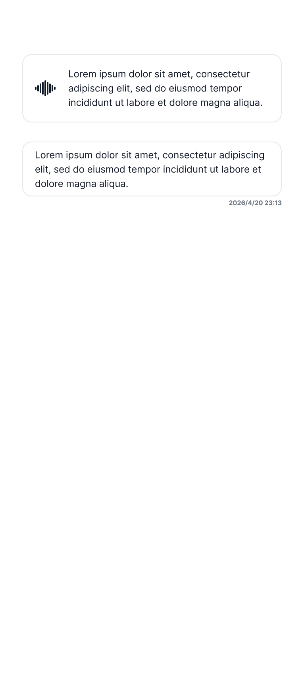

# Listening Second Item

**UIプレビュー:**

---

## 🎨 使用スタイル (01_system_tokens)
* **背景色**: レイヤー背景カラー

## 🧩 使用コンポーネント (02_components)
* **[`Voice Listening Card`](../../../02_components/details/VoiceListeningCard.md)**
* **[`Voice Card`](../../../02_components/details/VoiceCard.md)**

## 📐 画面レベルのレイアウト仕様
* **画面全体の余白**:
  * 左右パディング: `28.0` (トークン外の固有値)
  * 上下パディング: 上 `68.0`, 下 `32.0` (`spacing-xxl`)
* **アイテム間余白 (ListView Gap)**:
  * 各カード同士の隙間 (Gap): `spacing-xl` (24.0)

## 📝 状態特有の事実
* インタラクションが進み、確定したアイテム（Voice Card）と聞き取り中のアイテム（Listening Card）が並ぶ状態。
