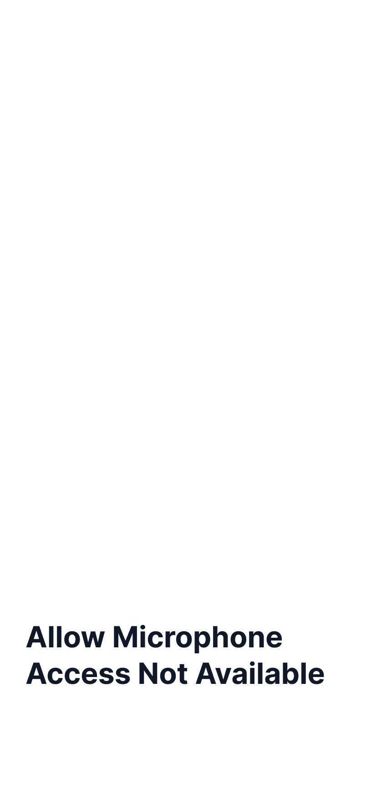

# Permission Microphone Unavailable

**UIプレビュー:**

---

## 🎨 使用スタイル (01_system_tokens)
* **全体背景色**: `Surface`
* **主要テキスト色**: `On Surface`
* **アクセントカラー**: `Error` または `On Surface Variant`

## 🧩 使用コンポーネント (02_components)
* **[`Intro and Setting Screen`](../../../02_components/details/IntroAndSettingScreen.md)**
* **[`content`](../../../02_components/details/Content.md)**

## 📝 状態特有の事実
* マイク機能がデバイス上で利用不可（ハードウェア制約など）な際のエラー状態。
