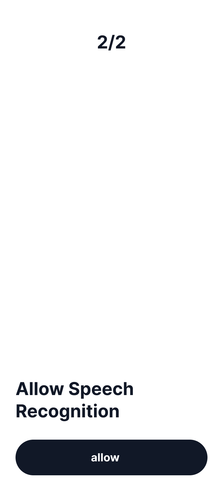

# Permission Speech Recognition Request

**UIプレビュー:**

---

## 🎨 使用スタイル (01_system_tokens)
* **全体背景色**: `Surface`
* **主要テキスト色**: `On Surface`

## 🧩 使用コンポーネント (02_components)
* **[`Intro and Setting Screen`](../../../02_components/details/IntroAndSettingScreen.md)**
* **[`sliding`](../../../02_components/details/Sliding.md)**
* **[`content`](../../../02_components/details/Content.md)**

## 📝 状態特有の事実
* マイクだけでなく、音声書き起こし等のための「Speech Recognition」権限を求める状態。
