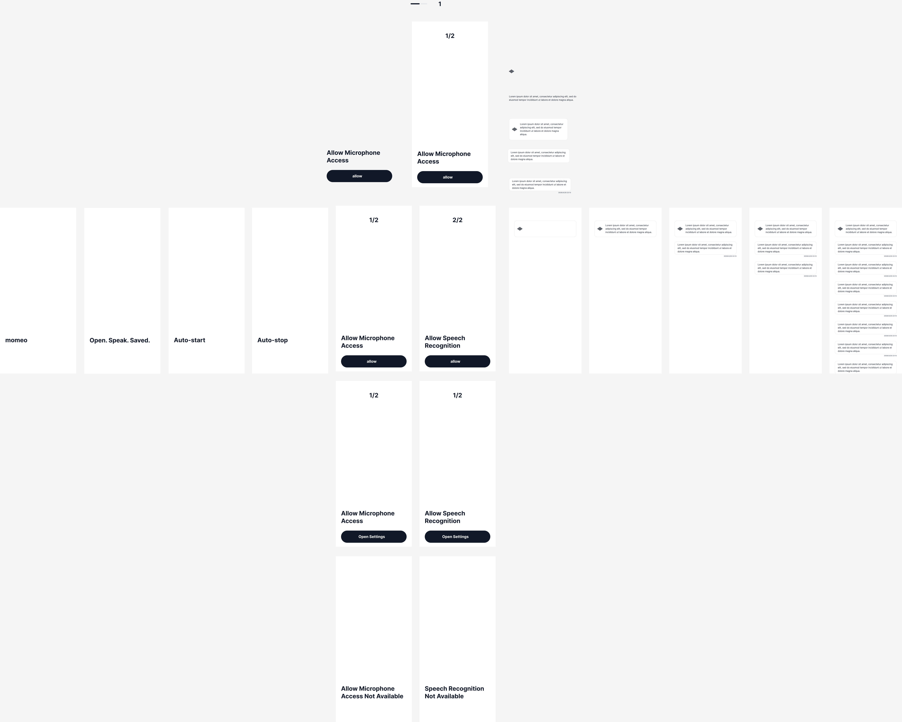
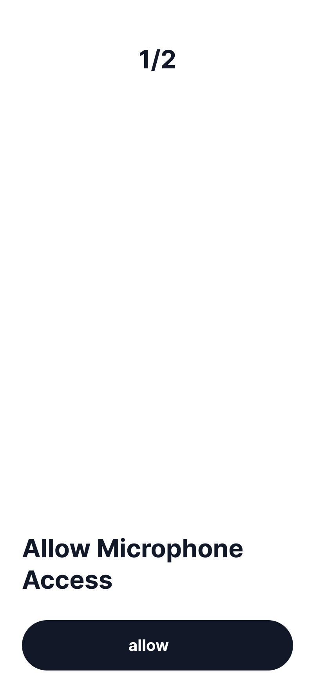
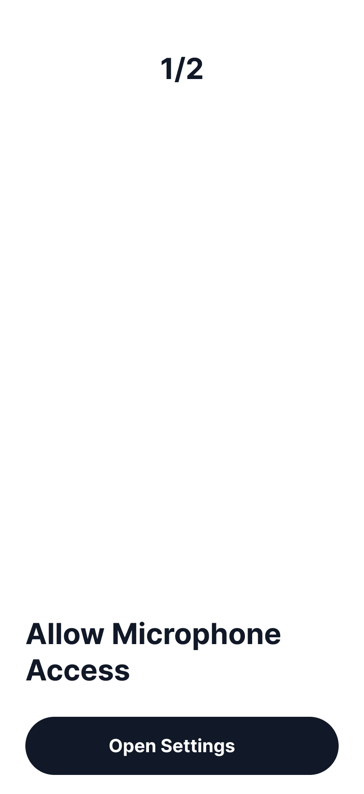
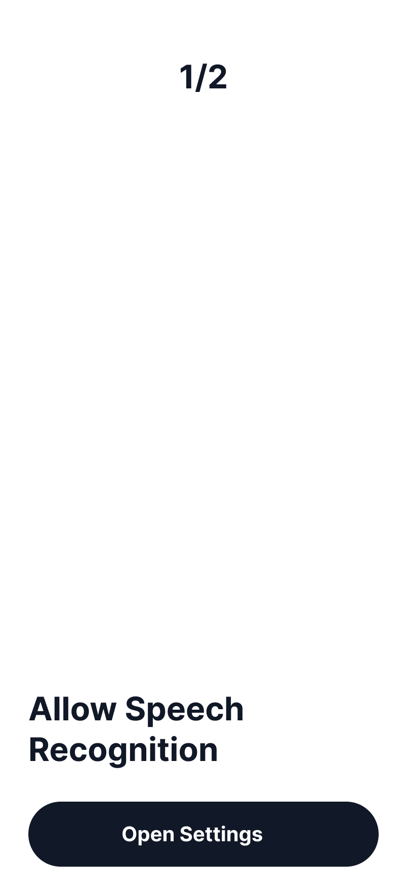
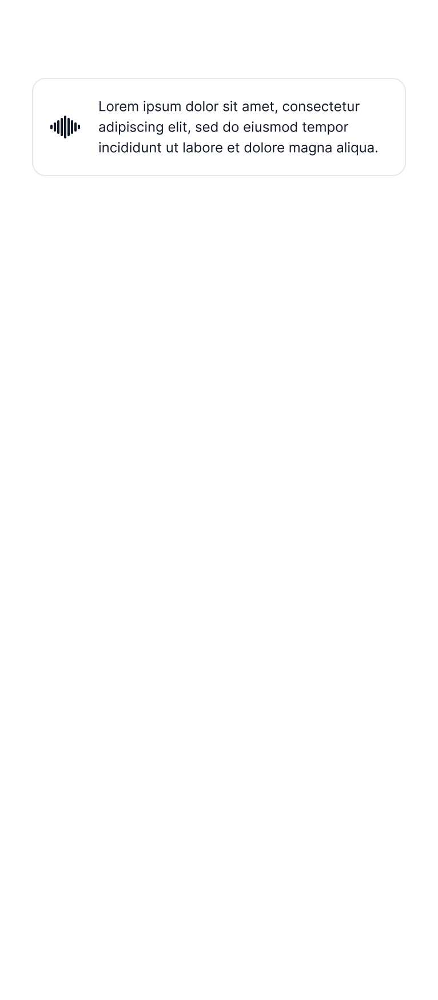
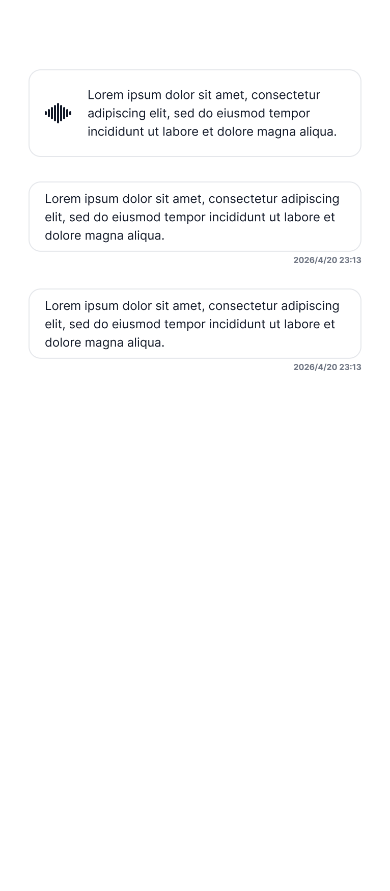
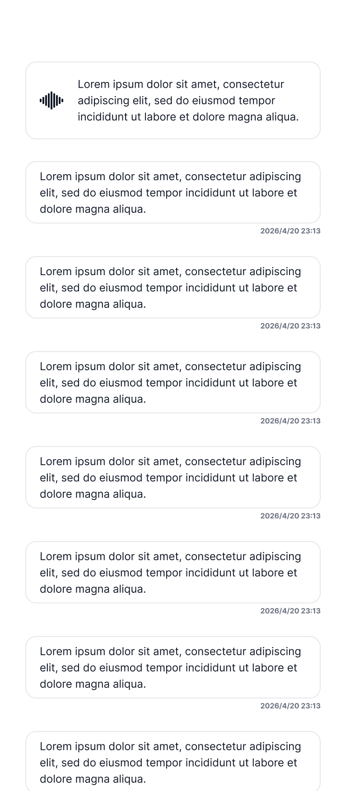

# 📱 Screen States Catalog

Figmaからエクスポートされた画面の「状態（State）」の一覧です。
（※各機能・フローごとに状態が整理されています）

## 🎨 全体像

---

## 1. Animated Onboarding View
起動時のアニメーションを含むオンボーディングビューの変遷状態です。
[📝 アニメーション詳細を見る](./details/AnimatedOnboardingSequence.md)

* 
* 
* 
* 

---

## 2. Permission (権限リクエスト) 関連
アプリ初回起動時や、マイク・音声認識が必要になった際の状態です。

| 状態名 | スクリーンショット |
| :--- | :--- |
| **Microphone Request**   [📝 詳細](./details/PermissionMicrophoneRequest.md) |  |
| **Microphone Settings**   [📝 詳細](./details/PermissionMicrophoneSettings.md) |  |
| **Microphone Unavailable**   [📝 詳細](./details/PermissionMicrophoneUnavailable.md) |  |
| **Speech Recognition Request**   [📝 詳細](./details/PermissionSpeechRecognitionRequest.md) |  |
| **Speech Recognition Settings**  [📝 詳細](./details/PermissionSpeechRecognitionSettings.md) |  |
| **Speech Recognition Unavailable**  [📝 詳細](./details/PermissionSpeechRecognitionUnavailable.md) |  |

---

## 3. Listening (音声認識) 段階
音声を認識・解析している際のUIの状態です。

| 状態名 | スクリーンショット |
| :--- | :--- |
| **Listening Initial**   [📝 詳細](./details/ListeningInitial.md) |  |
| **Listening First Item**   [📝 詳細](./details/ListeningFirstItem.md) |  |
| **Listening Second Item**   [📝 詳細](./details/ListeningSecondItem.md) |  |
| **Listening Third Item**   [📝 詳細](./details/ListeningThirdItem.md) |  |
| **Listening Many Items**   [📝 詳細](./details/ListeningManyItems.md) |  |
