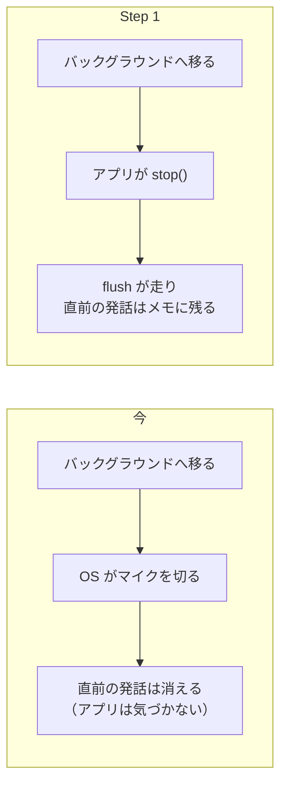
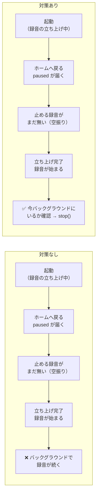

# Step 1: バックグラウンドで録音を止め、フォアグラウンドで再開する

## ひとことで言うと

アプリがバックグラウンドに移ったら録音を止め、フォアグラウンドに戻ったら再開する。

これをアプリ自身のコードにする。

今も同じ動きに見えるが、止めているのは OS で、アプリは何もしていない。

この役割をアプリに移す。

## なぜやるか

今バックグラウンドで録音が止まるのは、OS に「バックグラウンドのアプリはマイクを使えない」というルールがあり、OS がマイクを切っているから。

この後のステップで「このアプリはバックグラウンドでも録音を続ける」と OS に宣言する設定を入れる（Android は Step 2、iOS は Step 5）。

宣言すると OS はマイクを切らなくなる——アプリ内の「バックグラウンド録音」設定（ボトムシートにある ON / OFF。UI は実装済み・初期値 OFF）を OFF にしていても。

そうなったとき「設定 OFF ならバックグラウンドでは録らない」を実現できるのは、ここで作る停止処理だけ。

つまりこのステップは、バックグラウンドでも録音 **OFF を実現するためのもの**。

なお Step 1 の時点では設定をまだ読まず、ON / OFF どちらでも同じ挙動（バックグラウンドで止まる）にする。

設定による分岐は Step 2・5 で入れる。

## おまけ

今のバグも1つ直る。

アプリが自分で止めれば flush（書きかけの発話を確定して保存する処理）が走るので、バックグラウンドに移る直前の発話がメモに残るようになる。

今は OS に切られて消えている。

## どんな実装をするか

ユーザーがホームへ戻ったりアプリに戻ってきたりすると、Flutter はその瞬間に「バックグラウンドに移ったよ」「戻ってきたよ」というイベント（アプリの中だけの連絡。画面には何も出ない）を送ってくる。

これを受け取る標準部品が `AppLifecycleListener` で、それを `ListeningNotifier`（`lib/providers/listening_providers.dart`）に持たせる。

このイベントは全部で5種類ある。

反応するのは paused と resumed の2つだけで、残りの3つは無視する。

なお Step 2 以降に出てくる「通知」は、通知欄など画面に出るものを指す。このイベントとは別物。

| イベント                            | 状況                       | すること                      |
| ------------------------------- | ------------------------ | ------------------------- |
| paused                          | ホームや他アプリへ移り、バックグラウンドに移った | `stop()`（flush で直前の発話を保存） |
| resumed                         | フォアグラウンドに戻ってきた           | `start()`（録音中なら何もしない）     |
| 残りの3つ（inactive・hidden・detached） | 画面の上から通知の一覧を引き出しただけ、など   | 何もしない（録音は続く）              |

触るのは `ListeningNotifier` だけ。

- パイプライン（`SttListeningPipeline`。録音 → 文字化 → 保存の本体）は**変更しない**。止めて再開しても壊れない作りが既に済んでいる
- 監視の後片付けは、`ListeningNotifier` が消えるとき（autoDispose）の片付け処理に1行足すだけ

罠が1つだけある。

録音の立ち上げには少し時間がかかるため、その途中でホームへ戻られると paused のイベントが先に来てしまい、止め損ねる。

対策は図の下の段。

立ち上げが終わった時点（`_startPipeline()` の完了時）に、アプリが今バックグラウンドにいるかを1回調べ、いたら録音を止める。
