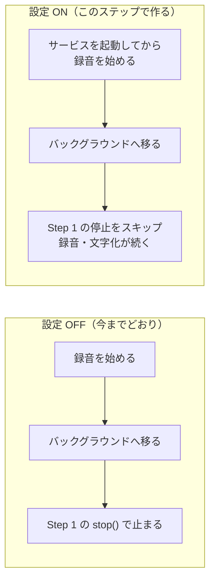

# Step 2: 「バックグラウンド録音」を ON にした Android で、バックグラウンドでも録音を続ける

## ひとことで言うと

ボトムシートの「バックグラウンド録音」設定は、いまは UI があるだけで挙動に効かない。

この設定の ON を、Android でここで実現する。

設定を ON にしていれば、バックグラウンドに移っても録音・文字化が続くようになる。

鍵はフォアグラウンドサービス（通知を出し続けることと引き換えに、バックグラウンドでも動き続けることを OS が認める仕組み）の導入。

## なぜやるか

Step 1 で見た「バックグラウンドのアプリはマイクを使えない」というルール（Android 9 以降）には、例外が1つだけある。

それが microphone タイプのフォアグラウンドサービスで、いま使っている録音パッケージ（`record`）単体では実現できず、`flutter_foreground_task` というパッケージが要る（→ `../../android.md`）。

サービスが動いている間は常駐通知（この間ずっと出続ける通知）が出る。

これは OS の仕様で、「ユーザーに知らせずにバックグラウンドで動き続けることはできない」ようになっている。

動くこと自体は実機検証済みで、そのときの実装全文が `../../verified_implementation.md` に残っている。

ただし検証実装は「録音するなら常にサービスを立てる」という直結で、設定も Step 1 も見ていない。

設定と結線し直して組み込むのがこのステップ。

## どんな実装をするか

`flutter_foreground_task` を導入し、`AndroidManifest.xml` に権限2つ（`FOREGROUND_SERVICE`・`FOREGROUND_SERVICE_MICROPHONE`）と `microphone` 型のサービスを宣言する（`../../verified_implementation.md` §1〜3 の再現）。

サービスの起動・停止だけを持つ部品 `ListeningForegroundService` を復元する（同 §4）。

サービスは「バックグラウンドでも録音し続ける権利と常駐通知」としてだけ使い、録音・VAD・文字化は今までどおりアプリ本体側のパイプライン（`SttListeningPipeline`）が行う。

サービス側で動く別プログラム（TaskHandler）は使わない。

iOS ではこの部品は何もしない。

設定との結線はこうする。

- 録音を止めるときはサービスも畳む。通知を出しっぱなしにしない
- 録音中に設定を切り替えたら、その場で反映する。ON でサービス起動、OFF でサービス停止（以降は Step 1 の挙動）

罠が1つだけある。

サービスは録音を始める**前**に起動すること。

順序が逆だと、バックグラウンドに移った時点でマイクを切られる。