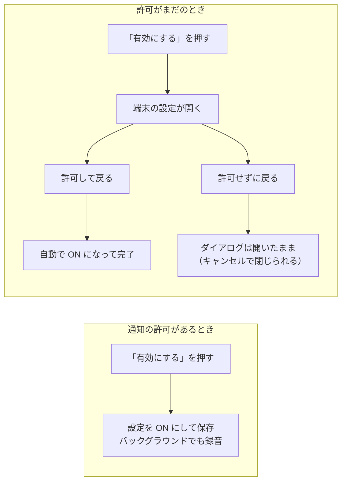

# Step 3: 通知許可が取れたときだけ「バックグラウンド録音」を ON にする

## ひとことで言うと

Android では、通知の許可が取れているときだけ「バックグラウンド録音」を ON にできる。

許可がまだ無いときは、開示ダイアログの「有効にする」が端末の設定を開き、そこで許可して戻ってくると自動で ON になって完了する。

出すダイアログは開示の1枚だけ。OS の通知許可ダイアログは使わない。

## なぜやるか

Step 2 の常駐通知は、録音中だとユーザーが気づくための唯一の表示。

ところが Android 13 以降、通知を出すには OS の許可（`POST_NOTIFICATIONS`）が要り、拒否されるとサービスは動くのに通知だけが出なくなる。

つまり「録音は続いているのに、ユーザーには何も見えない」という状態ができてしまう。

これは Play（Google Play。Android の公式ストア）の原則「ユーザーが実行を認識できること」に反する（→ `../../android.md`）。

先に設定を ON で保存してから許可を求める順序だと、許可を拒否されたのに設定は ON という嘘の状態が残る。

だから順序を逆にして、「許可が取れたから設定を ON にする」に変える。

## どんな実装をするか

流れはこれ。

場所は `lib/widgets/listening_inset_sheet.dart` の開示ダイアログ（初めて設定を ON にするとき、仕組みを説明して同意を取るダイアログ）。ダイアログ自身が通知の許可状態を持ち、フォアグラウンド復帰のたびに確認し直す。

本文には通知についての一文を挟む（Android のみ）。許可がまだのときは「…通知の許可が必要です。「有効にする」を押すと端末の設定が開くので、momeo の通知を許可してください。」とボタンの挙動を予告し、許可済みのときは「録音中は、録音していることを通知でお知らせし続けます。」と常駐通知が出ることだけ伝える。

- 自動で ON になるのは、「有効にする」から設定へ行った場合だけ。ダイアログを開いたまま自力で OS 設定から許可してきた場合は、本文が許可済みの文面に変わり、ボタンで確定する（同意 =「有効にする」の押下、を崩さない）
- 許可は OS 設定から後で取り消せる。録音を始める場面では毎回確認し、無ければサービスを立てず Step 1 の挙動（バックグラウンドで止まる）に落とす（画面には何も出さない）。次に ON にする操作では、開示に同意済みでも開示ダイアログをもう一度出す（許可への導線を兼ねるため）
- Android 12 以前には `POST_NOTIFICATIONS` が無く、常に許可済みと同じ流れになる
- iOS にはゲートが無く、開示1枚で ON になる。通知の許可を条件にするのは、規約上の要件がある Android だけ（iOS は通知を使わないため、許可自体を求めない → Step 6）
