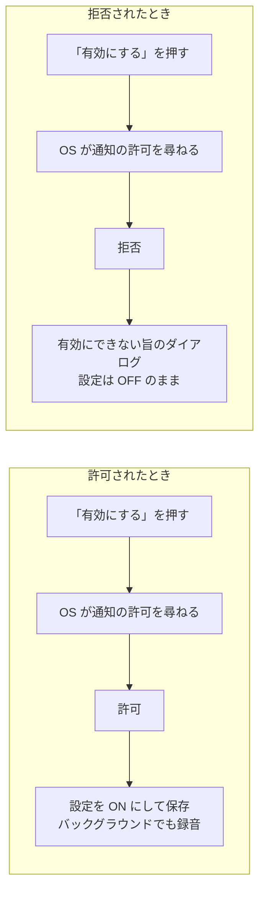

# Step 3: 通知許可が取れたときだけ「バックグラウンド録音」を ON にする

## ひとことで言うと

「バックグラウンド録音」設定を ON にする操作は今、説明と同意だけで完結し、通知の許可を求めていない。

これを「説明と同意 → OS に通知の許可を求める → 許可が取れたら設定を ON にする」という一本の流れにする。

許可を拒否されたら、設定は OFF のままにする。

## なぜやるか

Step 2 の常駐通知は、録音中だとユーザーが気づくための唯一の表示。

ところが Android 13 以降、通知を出すには OS の許可（`POST_NOTIFICATIONS`）が要り、拒否されるとサービスは動くのに通知だけが出なくなる。

つまり「録音は続いているのに、ユーザーには何も見えない」という状態ができてしまう。

これは Play（Google Play。Android の公式ストア）の原則「ユーザーが実行を認識できること」に反する（→ `../../android.md`）。

先に設定を ON で保存してから許可を求める順序だと、許可を拒否されたのに設定は ON という嘘の状態が残る。

だから順序を逆にして、「許可が取れたから設定を ON にする」に変える。

## どんな実装をするか

作る流れはこれ。

差し込む場所は `lib/widgets/listening_inset_sheet.dart` の開示ダイアログ（初めて設定を ON にするとき、仕組みを説明して同意を取るダイアログ。実装済み）の周辺。

冒頭の「説明と同意」はこれのこと。

初めて ON にするときだけ、開示ダイアログ → OS の通知許可ダイアログと2つ続く。開示は一度同意すれば再表示せず、OS も一度の回答を覚えるので、2回目以降の ON では普通はどちらも出ない。

開示ダイアログの本文には、通知についての一文を挟む（Android のみ）。通知の許可がまだ取れていないときは、通知の許可が条件であることを伝える（「ほかのアプリを使っている時にも録音していることをお知らせし続けるため、通知の許可が必要です。」。次に出る OS の許可ダイアログが唐突にならないようにする）。許可済みのときは、常駐通知が出ることだけ伝える（「録音中は、録音していることを通知でお知らせし続けます。」）。

「有効にする」が押されたら `POST_NOTIFICATIONS` を要求し、取れたときだけ `backgroundRecordingProvider` へ保存する。拒否されたら、有効にできない旨のダイアログ（開示ダイアログと同じ型・OK のみ）を出して OFF のまま。

- 許可は OS 設定から後で取り消せる。だから設定が ON のまま録音を始める場面でも毎回確認し、無ければサービスを立てず Step 1 の挙動（バックグラウンドで止まる）に落とす。このときは画面に何も出さない（ログのみ。自分で OS 設定を触った稀なケースであり、見せ方の作り込みは後からできる）
- Android 12 以前には `POST_NOTIFICATIONS` が無い。要求は常に成功扱いになり、同じ流れを素通りする
- iOS も「設定を ON にする操作の中で許可を求める」型は同じ。ただし iOS は拒否されても設定を ON にする。許可を条件にするのは、規約上の要件がある Android だけ（→ Step 6）
