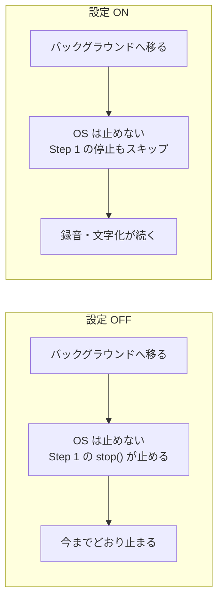

# Step 5: 「バックグラウンド録音」を ON にした iOS で、バックグラウンドでも録音を続ける

## ひとことで言うと

「バックグラウンド録音」設定の ON を、iOS でここで実現する。

変更は2つだけ——`Info.plist` に宣言を4行足すことと、Step 1 の停止処理に設定を読ませること。

ここで、設定カードの ON 側の説明文が実装として真になる。

## なぜやるか

iOS では「このアプリはバックグラウンドでも音声を扱う」という宣言（`UIBackgroundModes` の `audio`）を `Info.plist`（アプリの設定ファイル）に書くだけで、録音している限りバックグラウンドでも動き続けられる。

Android のようなサービスは無い。

`audio` だけ（`fetch` は不要）で録音・VAD・文字化がバックグラウンドで動くことは実機検証済み（→ `../../ios.md`）。

ただしこの宣言はアプリに焼き込まれ、実行中に付け外しできない。

宣言を入れた瞬間から、設定 OFF のユーザーの端末でも OS はバックグラウンドで止めてくれなくなる。

だから宣言を入れた後は、設定が ON のときの挙動も OFF のときの挙動も、Step 1 が支える。

Step 1 を先に済ませたのはこのため。

なお Android と違って、設定を切り替えた瞬間には何も起きない。

効くのは次にバックグラウンドへ移ったときから（→ `../../overview.md` の「設定の ON / OFF が効くタイミング」）。

## どんな実装をするか

- `ios/Runner/Info.plist` に `UIBackgroundModes` の `audio` を追加する（4行）
- Step 1 のバックグラウンド停止に設定を読ませる。ON なら止めない、OFF なら今までどおり止める

動作確認には罠がある。

debug ビルドは、デバッガがつながっていること自体がバックグラウンド停止を抑止するため、判定に使えない。

release ビルド・デバッガ非接続で行い、ログも読めないので「バックグラウンドで話した内容がメモに残るか」で判定する（→ `../../ios.md`）。

そして設定 ON の確認と同じ重みで、OFF も確認する。

宣言後の「OFF なら止まる」挙動は、壊れてもユーザーからも審査からも見えにくく、Apple 5.1.1(ii)（同意を撤回する手段の要求）に関わる。
