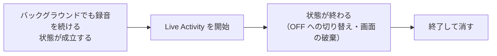

# Step 6: iOS の録音中の表示（Live Activity）

## ひとことで言うと

「バックグラウンド録音」設定が ON で、録音したままバックグラウンドにいる間、Live Activity（ロック画面と Dynamic Island に出続ける表示）で momeo が録音中であることを示す。

通知は使わない。通知の許可も求めない（iOS では OS の許可ダイアログを1枚も出さない）。

## なぜ Live Activity か

Apple 2.5.14 が求めるのは「明示的な同意」と「録音中の明確な表示」の2つ。

- 同意 → 開示ダイアログと、デフォルト OFF の設定で満たす（→ `../phase1/step03_notification_permission_gate.md`）
- 表示の最低線 → OS のオレンジの点で満たせる

オレンジの点で最低線が満たせる根拠は3つ（→ `../../spike_findings.md` の決定の表）。

- Apple DTS のエンジニアが「バックグラウンドで継続する録音はオレンジのピルとしてユーザーに見える」と回答している（https://developer.apple.com/forums/thread/776949）
- オレンジの点の導入（iOS 14、2020年9月）以降、録音中表示の不足を理由にしたリジェクト事例が見つからない
- オレンジの点だけに頼る録音アプリが多数ストアに並んでいる

ただしオレンジの点は「どれかのアプリがマイクを使っている」としか示さず、momeo だとは分からない。momeo の名前で録音中だと分かる表示を、ユーザーに通知の許可を求めることなく出せる手段が Live Activity（許可不要・デフォルトで有効。録音アプリの標準的な手段でもある）。

ローカル通知は使わない。通知の許可が要るわりに、一度きりの表示しかできないため。

## 仕様

| 項目 | 内容 |
|---|---|
| 対応 OS | iOS 16.1 以降。未満はオレンジの点のみ（何も出さない） |
| ロック画面 | momeo のアイコン+「音声を認識しています」+このセッションで書き留めたメモの件数 |
| 件数 | メモが確定するたびに +1 して表示を更新する。0件の間は件数行を出さない。表示の開始ごとに 0 から数える |
| Dynamic Island | compact（常時見える小さい表示）はマイクのアイコン1つ。expanded（長押しで開くカード）はロック画面と同じ内容。minimal もマイクのアイコン |
| ボタン | 置かない |
| 文言 | 「音声を認識しています」。Android の常駐通知の文言もこれに揃える（通知チャンネルの説明文も同様） |

経過時間は表示しない。時間は「どれだけ録りっぱなしか」というコストを見せる情報で、アプリを閉じる動機になり得る。件数は「どれだけ書き留めたか」という価値を見せる情報で、動いていることの証明にもなる。

## 出す・消すタイミング

Live Activity は**アプリがフォアグラウンドにいる間しか開始できない**（バックグラウンド遷移の後に開始しようとすると「Target is not foreground」で失敗する）。だから出すのは「バックグラウンドへ移ったとき」ではなく、「バックグラウンドでも録音を続ける状態が成立したとき」（設定 ON で録音が始まる・録音中に ON へ切り替える。どちらもフォアグラウンドで起きる）。

このため、momeo をフォアグラウンドで使っている間も Dynamic Island にはマイクのアイコンが出続ける（録音アプリの標準的な見え方）。ロック画面に出るのは画面を消している間で、これが本来の目的の場面。

フォアグラウンド復帰のたびに、状態が続いているのに表示が消えていないかを確認し、消えていたら出し直す（スワイプで消された・OS 設定のライブアクティビティを切って戻された・OS に終了させられた、の回収路。スワイプで消した直後はそのまま消えたままで、次にアプリを開いたときに戻る）。

逆に、アプリだけが先に消えて Live Activity が残る場合もある（アプリスイッチャーからの終了・クラッシュ・OS によるメモリ回収）。Live Activity はアプリが終了しても OS が自動で消さないため、Dynamic Island にマイクのアイコンだけが取り残される。この回収路は2段構え。

- アプリスイッチャーからの終了では、OS が終了前に `applicationWillTerminate` を数秒だけ呼ぶ。ここで残っている Live Activity を全部終了する（AppDelegate。Dart は動かないので Swift の ActivityKit で直接行う）
- クラッシュなど上が呼ばれない場合に備え、アプリ起動時にも残っている Live Activity を全部終了する。起動直後の開始は、この片付けが終わるのを待ってから行う（片付けが後から走ると、出したばかりの表示を消してしまうため）

## 8時間の上限

1つの Live Activity は開始から8時間で OS に終了させられる。開始から7.5時間で一度終了して出し直す（件数は引き継ぐ）。アプリ本体は録音で生き続けているため、タイマーを1本持つだけで足りる。

## 実装の形

- ロック画面と Dynamic Island の見た目は Widget Extension（Swift / SwiftUI で書く、アプリ本体とは別の小さなプログラム）が描く。Dart だけでは書けない
- Flutter からの開始・更新・終了は live_activities パッケージ（2.4系。2.5以降はこのプロジェクトより新しい Dart SDK を要求する）で行う。Push 通知での更新は使わないため `iOSEnableRemoteUpdates: false` を明示する（既定の true は Push Notifications の capability を要求してしまう）
- ユーザーはスワイプで消せる。消されても録音は続く（Android の常駐通知と同じ関係）
