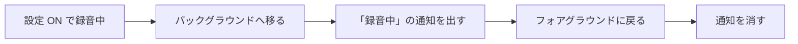

# Step 6: iOS のバックグラウンド録音中に「録音中」の通知を出す

## ひとことで言うと

「バックグラウンド録音」設定が ON で、録音したままバックグラウンドにいる間だけ、ローカル通知（アプリが自分で出す通知。サーバーは不要）で「録音中」を知らせる。

出すタイミングと消すタイミングはこの図のとおり。

## なぜやるか

Apple の規約 2.5.14 は、録音中であることの明確な視覚表示を求める。

Android は OS が常駐通知を強制するので自動的に満たすが、iOS に相当する仕組みは無い。

iOS の OS が出すのは、ステータスバーのオレンジの点だけ。

あれは「どれかのアプリがマイクを使っている」ことしか示さず、momeo だとは分からない（→ `../../ios.md`）。

何もしなければ、バックグラウンドで録音していることを momeo の名前で示す手段がゼロのままストアに出すことになる。

通知を1回出すだけでも「アプリを閉じたが録音は続いている」ことは伝わり、審査リスクは大きく下がる。

ロック画面に出続ける Live Activity が最も確実だが、Swift で書く拡張プログラム（Widget Extension）が要って実装が重いため、初期リリースはローカル通知で足りると判断済み（→ `../../ios.md` の比較表）。

## どんな実装をするか

- ローカル通知のパッケージを導入する（選定は着手時）
- 通知の許可は、Step 3 と同じく設定を ON に切り替える流れの中で求める。ただし Android と違い、**拒否されても設定を ON にする**。許可を条件にしない（審査事例と録音アプリの調査から、オレンジの点だけでも先例が多数あると確認済み → `../../spike_findings.md` の決定の表）
- 出すのは「許可がある・設定 ON・録音中」の3つがそろってバックグラウンドへ入ったときだけ。フォアグラウンドに戻ったら消す

罠が1つだけある。

バックグラウンドへ移った瞬間は、OS がまだアプリをフォアグラウンド扱いしていて、その時点で出した通知は表示されずに終わる。

1秒待ってから出し、待つ間にフォアグラウンドへ戻っていたら出さない（→ `../../spike_findings.md`）。
