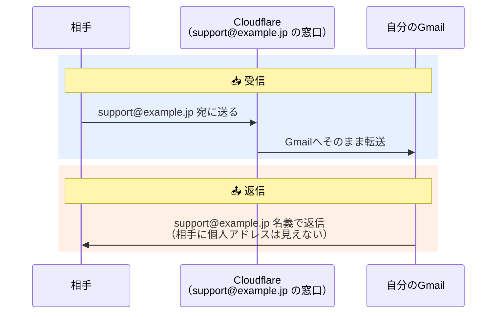

## 概要

個人でスマホアプリを作っています。

いざストアに公開しようとすると、プライバシーポリシーページやサポートページが必要になり、そこには**連絡先のメールアドレス**を載せなければいけません。

ここでちょっと嫌なことに気づきます。

**自分の個人のGmailアドレスを、全世界に公開することになる。**

スパム的にも気分的にも、これはできれば避けたいですよね。

かといって、`support@自分のドメイン` みたいなメールアドレスをちゃんと作ろうとすると、Google Workspace などの有料サービスが出てきます。月数百円とはいえ、そのアプリがどこまで続くか分からないし、マネタイズも考えていないのに固定費を増やすのは、個人開発ではけっこう抵抗があります。

そこで今回、**Cloudflare Email Routing + Gmail** の組み合わせで、独自ドメインのメールアドレスを**完全無料**で作ってみました。受信だけでなく、Gmailからそのドメイン名義で**返信**もできるようにしています。

同じことで困っている個人開発者は多いと思うので、手順をまとめます。

僕の場合、ドメインはお名前.comで取得済みという状態からのスタートです。

## 仕組み

登場人物は3人だけです。**相手（問い合わせてくる人）**、**Cloudflare（窓口）**、**自分のGmail（実体）**。



つまり、

- 相手から見ると、`support@example.jp` とやりとりしているように見える
- 自分から見ると、ぜんぶ普段のGmailの受信トレイで完結する

という状態になります。

大事なポイントは、Email Routing は**受信転送の仕組み**であって、メールボックスは作られない、という点です。メールの実体はぜんぶ手持ちのGmailに集約されます。

つまり、「独自ドメインのメールサーバーを持つ」のではなく、「独自ドメインの**窓口だけ**を作って、中身はGmailに任せる」という構成です。個人開発のサポート窓口には、これで十分でした。

## ほかの方法と比べてどうなの？

一応、ほかの選択肢も調べました。

| 方法 | 費用 | ひとこと |
|---|---|---|
| Cloudflare Email Routing + Gmail | **無料** | 今回の方法。受信転送 + Gmail名義送信 |
| さくらのメールボックス | 月88〜110円 | 本物のメールボックスが持てる。NS移管も不要 |
| Google Workspace | 月800円〜 | 本命だけど個人開発には過剰 |
| AWS（SES + Lambda で自作） | ほぼ無料 | 転送処理を自作・保守する必要があり、手間だけ大きい |

有料でよければ、さくらのメールボックスはかなり良い選択肢だと思います。ネームサーバーを移管したくない場合はこちらです。

AWSでも同じことは作れますが、SESで受けてLambdaで転送するコードを書いて保守することになります。得られる結果は同じなのに手間だけ大きいので、見送りました（ちなみに Amazon WorkMail は新規受付が終了していて、選択肢になりません）。

というわけで、「無料」かつ「保守ゼロ」の Cloudflare 一択でした。

## 全体の流れ

1. Cloudflare にドメインを追加し、DNSレコードを引き継ぐ
2. お名前.com でネームサーバーを Cloudflare に変更する
3. Email Routing を有効化し、`support@example.jp` → Gmail の転送を作る
4. Gmail の Send mail as で `support@example.jp` 名義の送信を設定する

順番に見ていきます。

## 📌 ステップ1：Cloudflare にドメインを追加

まず Cloudflare のアカウントを作ります（無料プランでOK）。

### 画面移動

ダッシュボードで「サイトを追加」


→ ドメイン名を入力 


→ **Free プラン**を選択します。


すると、既存のDNSレコードのスキャンが走り、DNSレコードの一覧画面になります。

ここでやることは2つ、「ゴミレコードの削除」と「（任意）レコードの追加」です。

### ゴミレコードの削除

まず削除から。一覧には、身に覚えのないレコードがずらっと並んでいるはずです。

僕の場合、`_dmarc` / `mail` / `www` / `test` などのNSレコード（値がお名前.comのDNS）や、パーキングページ由来のTXTレコード・MXレコードが取り込まれていました。


これらは、お名前.comが「取得しただけ（パーキング状態）」のドメインに置いている既定のレコードです。実在はするけれど、お名前.comの都合で置かれているだけで、自分には不要なものです。

チェックボックスで全選択して、まとめて削除しちゃいましょう。

### （任意）レコードの追加

次に追加です。

といっても、**メールアドレスを作るだけなら、ここで追加するレコードはありません**。

メールに必要なMXレコードとSPFレコードは、あとのステップでEmail Routingが自動で追加してくれます。
なので、ゾーンは空っぽのままステップ2に進んでOKです。

僕の場合、プライバシーポリシーページをGitHub Pagesでこのドメインに公開するので、「Add record」からGitHub Pages用のAレコードを4つ追加しました。

| Type | Name | IPv4 address | Proxy status |
|---|---|---|---|
| A | `@` | 185.199.108.153 | **DNS only（グレーの雲）** |
| A | `@` | 185.199.109.153 | DNS only |
| A | `@` | 185.199.110.153 | DNS only |
| A | `@` | 185.199.111.153 | DNS only |

最終的に、DNSレコードはこの4つだけの状態になりました。

## 📌 ステップ2：ネームサーバーの変更（お名前.com）

サイト追加が終わると、割り当てられたCloudflareのネームサーバーが2つ表示されます。

```text
例: dan.ns.cloudflare.com / paloma.ns.cloudflare.com
```

お名前.com側の「ネームサーバーの設定」で、`dns1.onamae.com` / `dns2.onamae.com` をこの2つに書き換えます。

| 項目 | 設定内容 |
|---|---|
| ネームサーバー1 | Cloudflareに表示された1つ目 |
| ネームサーバー2 | Cloudflareに表示された2つ目 |
| ネームサーバー3以降 | **空欄でOK** |


反映は通常数時間、最大72時間です。Cloudflareのダッシュボードが「アクティブ」になれば完了です。

これ以降、DNSレコードの管理はすべてCloudflare側で行うことになります。お名前.comのDNSレコード設定画面はもう使いません。

> ちなみに「ネームサーバーをCloudflareに移すと、将来AWS（Route 53）とかを使うときに困るのでは？」と僕も気になって調べたのですが、問題ありませんでした。
DNSの管理場所が変わるだけで、他のサービスとの併用に支障はありません。

## 📌 ステップ3：Email Routing の設定

ここからが本題です。ネームサーバーの反映後、Cloudflareダッシュボードのサイドバーから **Email Routing** を開き、対象ドメインを選びます。

最初は「Status: Disabled / DNS records: Not configured」という状態です。ここから「転送先の登録 → アドレスの作成 → 有効化」の順に進めます。

### 転送先のGmailを登録する

**Destination Addresses** タブを開き、「Add destination address」から自分のGmailアドレスを登録します。


登録すると、そのGmail宛にCloudflareから確認メールが届くので、メール内の **Verify email address** を押します。画面に戻って、ステータスが「Verified」になっていればOKです。

### カスタムアドレスを作る

**Routing rules** タブを開きます。


「Create address」から `support@example.jp` を作ります。


| 項目 | 設定内容 |
|---|---|
| Custom address | `support` |
| Action | Send to an email |
| Destination | さっき認証したGmail |

アドレスは何個でも無料で追加できます（`info@example.jp` とか）。「何でも受けるキャッチオール」も設定できますが、スパムも全部届くようになるので、必要なアドレスだけ作るほうがおすすめです。

### DNSレコードを追加して有効化する

最後に、メール受信に必要なDNSレコードを追加します。といっても手入力は不要です。

画面上部の「**Not configured**」リンク（または **Settings** タブ）を開き、「**Add records and enable**」ボタンを押すだけで、CloudflareがMXレコードとSPF用のTXTレコードを自動で追加してくれます。

Overviewに戻って、Status が **Enabled** になれば設定完了です。

### 動作確認

別のメールアドレスから `support@example.jp` 宛に送ってみて、自分のGmailに届けば成功です。届いた記録は **Activity Log** タブでも確認できます。

## 📌 ステップ4：Gmailから独自ドメイン名義で返信する

受信だけだと、返信したときに個人のGmailアドレスが相手に見えてしまいます。これでは元も子もないので、送信側も設定します。

Gmailの「**他のメールアドレスから送信（Send mail as）**」機能を使います。

### アプリパスワードを発行する

まず、Googleアカウントで2段階認証を有効にした上で、**アプリパスワード**を発行します（Googleアカウント管理 → セキュリティ → アプリパスワード）。

### Gmailに送信用アドレスを追加する

Gmailの設定 → **アカウントとインポート** → 「他のメールアドレスを追加」から、次の内容で登録します。

| 項目 | 設定内容 |
|---|---|
| メールアドレス | `support@example.jp` |
| エイリアスとして扱う | チェックする |
| SMTPサーバー | `smtp.gmail.com`（ポート587 / TLS） |
| ユーザー名 | 自分のGmailアドレス |
| パスワード | さっき発行したアプリパスワード |

登録すると `support@example.jp` 宛に確認コードが送られます。ステップ3の転送設定が済んでいるので、これもGmailに届きます。コードを入力して完了です。

### SPFレコードにGmailを追記する

迷惑メール判定を減らすため、CloudflareのDNSで、Email Routingが作ったSPFレコード（TXT）にGmailの送信サーバーを追記しておきます。

```text
変更前: v=spf1 include:_spf.mx.cloudflare.net ~all
変更後: v=spf1 include:_spf.mx.cloudflare.net include:_spf.google.com ~all
```

### 返信モードを設定する

最後に、Gmailの設定で「デフォルトの返信モード」を「**受信したアドレスから返信する**」にしておきます。

こうすると、`support@example.jp` 宛に来たメールへ返信するとき、**自動で support 名義**になります。いちいち差出人を切り替える必要がなく、事故（うっかり個人アドレスで返信）も防げます。

## 知っておくべき制約

無料なだけあって、万能ではありません。使ってみて把握しておくべきだと思った点です。

- **受信転送専用**。メルマガのような大量送信には使えません。サポート窓口の受信 + 個別返信という用途なら十分です
- Gmail SMTP経由の送信は、DKIM署名が独自ドメインではなく gmail.com になります。厳格な受信サーバーでは「via gmail.com」と表示されたり、迷惑メール判定される可能性がゼロではありません。気になるレベルになったら、有料のメールボックスへの移行を検討するタイミングだと思います
- MXレコードはドメインにつき1系統なので、将来同じドメインで別のメール受信サービスを使いたくなったら同居はできません（サブドメインのMXで回避はできます）

逆に言うと、「個人開発アプリのサポート窓口」という用途では、この制約はどれも実質問題になりませんでした。

## まとめ

- 個人開発アプリの公開には連絡先メールアドレスが必要。でも個人アドレスの公開は避けたい
- **Cloudflare Email Routing + Gmail** なら、独自ドメインのメールアドレスを**無料**で用意できる
- 受信はCloudflareが転送、送信はGmailの Send mail as。メールの実体はぜんぶ手持ちのGmailに集約
- 代償はネームサーバーのCloudflare移管だけ。ドメインはお名前.comのままでOK

👉 **費用ゼロ・保守ゼロで、`support@自分のドメイン` が手に入る**

ストア公開の準備をしている個人開発者の方は、プライバシーポリシーページを書く前に、まずこのメールアドレスを作っておくのがおすすめです。
